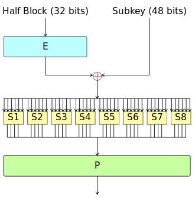
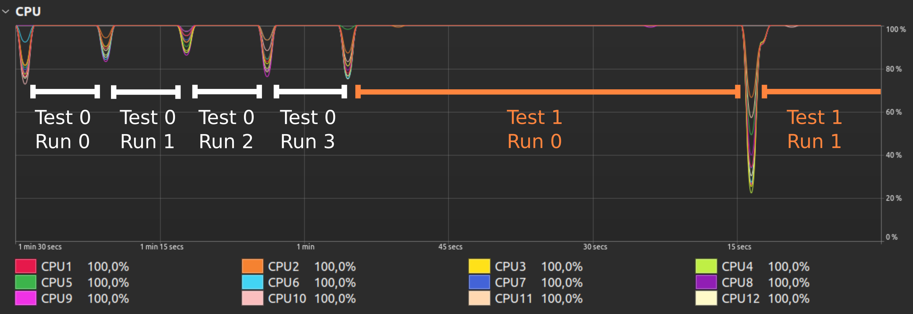
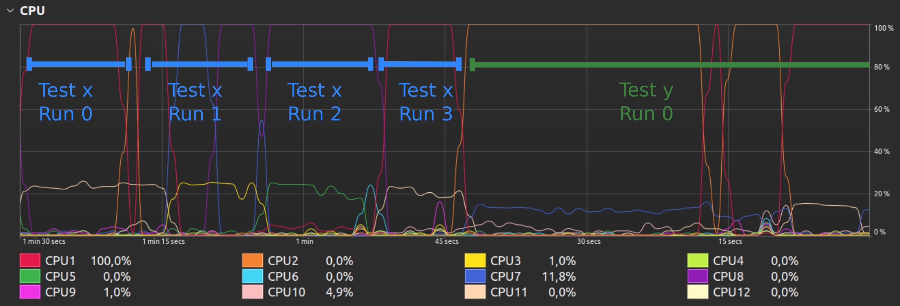
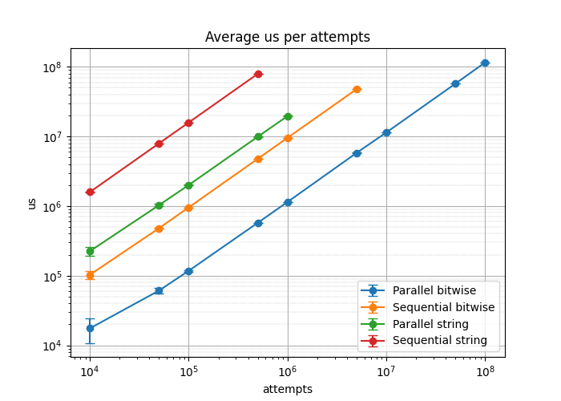
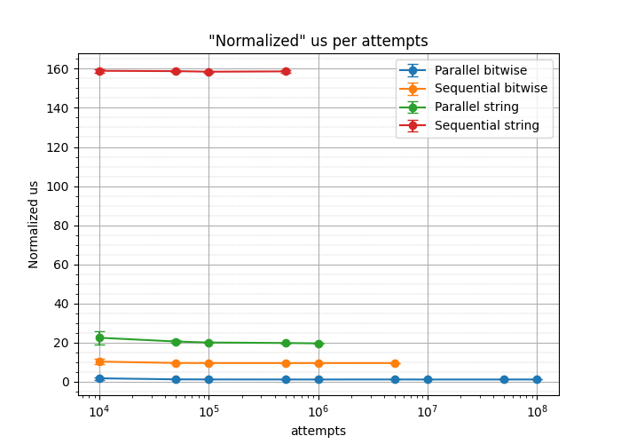
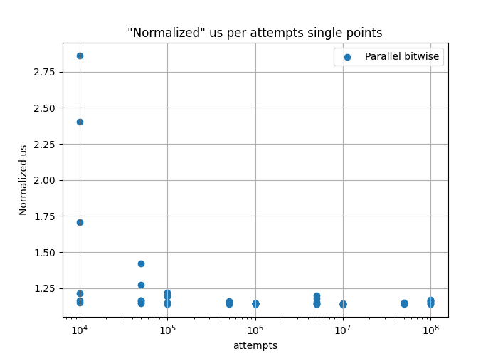
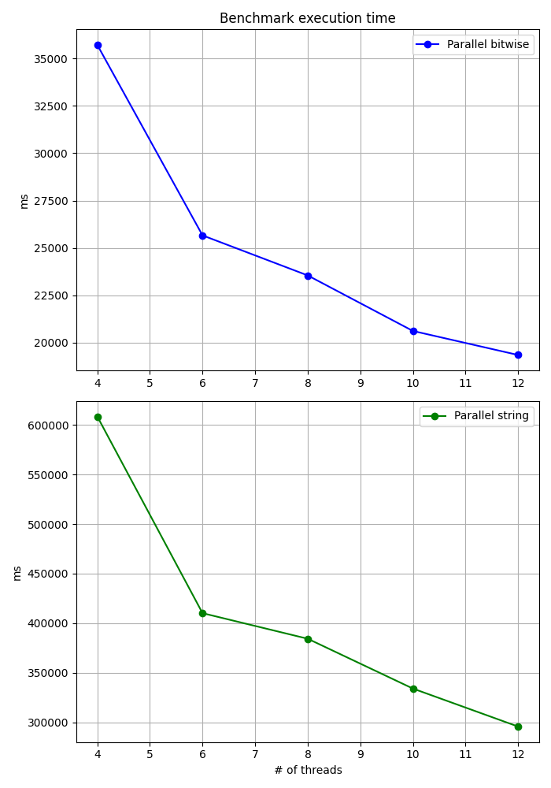
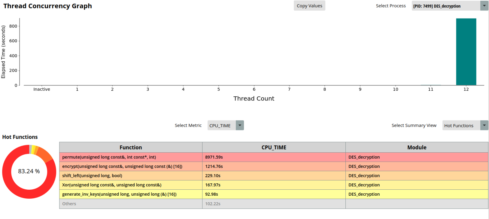

# DES decryption

  
Table of Contents

  <ol>
    <li><a href="#About">About</a></li>
    <li><a href="#Software Environment">Software Environment</a></li>
    <li><a href="#DES algorithm">DES algorithm</a></li>
    <li><a href="#Test methodology">Test methodology</a></li>
    <li><a href="#Results analysis">Results analysis</a></li>
    <li><a href="#Profiling">Profiling</a></li>
    <li><a href="#Appendix">Appendix</a></li>
    <li><a href="#Project Authors">Project Authors</a></li>
  </ol>

## About
In the following project I developed **several sequential and parallel implementations of the DES algorithm**. The project was developed **from scratch in C++ using only the standard libraries**. To parallelize the code execution I chose **OpenMP as the parallel framework**. For simplicity I chose to use 64-bit key and 64-bit block text. Four different implementations were created: the first two differ in the datatype used to represent the key and text (strings and uint64_t), while the second two are a parallel version of the previous two. In addition to providing all the necessary functions for using DES to encrypt and decrypt text, a **dedicated bruteforce benchmark** was created to evaluate performance. In the next section is a brief summary of how the DES algorithm works. Next is a description of the hardware configuration used and the tools used to analyze system performance. Next is a **performance comparison** on the benchmark obtained from the different implementations and finally a **summary on the speedup achieved**. 

## Software Environment
- **Operating System**: Ubuntu 22.04 LTS
- **C/C++ Compiler**: GCC 11.4.0
- **Parallel framework**: OpenMP 5.0
  
## DES algorithm
The [Data Encryption Standard (DES)](https://en.wikipedia.org/wiki/Data_Encryption_Standard) is a symmetric key encryption algorithm designed to encrypt and decrypt data. The basic steps of its operation can be divided into two parts:
1. **Subkey generation**
  <ul>
    <li>The provided 64-bit key is reduced to 56 bits by going to eliminate one of every eight bits. This 56-bit key is divided into 16 subkeys of 48 bits each through a scheme complex permutations and rotations.
       
      
       
   </li>
 </ul>

2. **Message encryption**
  <ul>
    <li><i>Initial data block (IP) permutation</i>: the 64-bit plaintext is initially permuted using a permutation table.</li>
    <li>
      <i>Feistel function</i>: the algorithm uses a Feistel network approach, dividing the data block into two halves each of 32 bits. Feistel's function operates on one half and consists of an expansion phase that takes 32 to 48 bits, an XOR phase with one of 16 subkeys, a processing phase with substitution boxes, and finally a permutation. 
       
      
       
      This described procedure is performed 16 times, always using a different subkey.
       
      
    </li>
    <li><i>Final permutation (FP)</i>: the two halves obtained are exchanged and recombined through a final permutation obtaining the ciphertext.</li>
  </ul>

Since DES is an encryption algorithm that uses a symmetric key we have that the decryption process is similar, the only difference being the use of subkeys in reverse order.

## Test methodology
In order to be able to objectively analyze the different performances of the present implementations, it was necessary to create a special benchmark. This benchmark is composed of several tests where each of these tests consists of making *n* attempts in which starting from an always different *key* the inverse keys are generated, the message is decrypted and it is checked if it coincides with the plaintext. To achieve better reproducibility of the results, the same test is run several times. To avoid the occurrence of potential thermal throttling, it was decided to lower the maximum frequency of the processor through the use of the *cpupower-gui* utility. The program therefore was run on Ryzen 5 2600 CPU (6 cores/12 threads) at 2.8GHz and OS Ubuntu 22.04. 

## Results analysis
The CPU usage in the case of parallel execution and sequential execution is shown below

*CPU usage parallel*

*CPU usage sequential*

In the parallel case, we can see a complete utilization of all threads available from the time of starting a test run until its completion, where we have the end of the parallel region and a wait for all threads to finish. Because the workload is balanced, i.e. all threads must perform an equal number of operations, there is full CPU utilization, with almost zero synchronization time.

In the next figure is shown  the average time required to try *n* keys (called attempts) . We can see that as the number of attempts to execute increases, there is a linear growth in the time required to complete the execution.

*microseconds taken to perform n attempts*

Next image shows a "normalized" graph in which the y-axis represents the average time taken to test a key divided by the total number of keys tried. It can be seen that the sequential bitwise implementation performs much better than the "naive" implementation using strings, in fact we have that it is over 2 times faster than the parallel "naive" string implementation and almost 10 times faster than the sequential "naive" string implementation. The bitwise parallel implementation is obviously the most efficient by being about 8 times faster than the bitwise sequential version. We also note that the average normalized execution time does not appear to vary particularly with the number of attempts executed.

*"Normalized" microseconds taken to perform n attempts*

The advantage of executing a larger number of attempts is to spread the computation over a longer time and thus minimize the incidence of any uncontrollable external events (such as operating system processes) and the initial creation of the group of threads. This gives a normalized average execution time with a lower variability band, as can be seen from the figure below.

*microseconds taken to perform n attempts, single runs*

The next graph shows the variation in the time required to complete the benchmark as a function of the number of threads used. In conducting this test, it was particularly important to go for limiting the maximum achievable frequency since hardware manufacturers use strategy to optimize the use of CPU resources. Particularly when all threads are engaged, the processor may reach its power or temperature limit more quickly, limiting its ability to increase frequencies. However, when fewer threads are used, the processor can concentrate more resources on each thread, allowing higher frequencies for those specific threads.

*milliseconds taken to run the benchmark with a variable number of threads*

## Profiling
The AMDuProf utility was used to perform the profiling. With this tool, among many things, it is possible to go and get a quick idea about the actual utilization of the available threads and figure out which code operations are most costly.

*Summary produced by AMDuProf*

We can see that the program turns out to make perfect use of all available threads and that the function that uses the CPU the most is permute. It is also possible to use AMDuProf to go directly to analyze the individual assembly instructions that make up the operation.

## Appendix
The bitwise implementation produced turns out to be a good starting point, but in any case there are far more optimized methods for performing DES in software. I have considered this task outside the scope of this project, but for further reference you can refer to the following [material](https://darkside.com.au/bitslice/) provided by Matthew Kwan.

## Project Authors
This project was carried out by Jacopo Damerini for the course "Parallel Computing" in the Advanced Computing curriculum of the Master of Science degree in Computer Engineering at the Università degli Studi di Firenze. 
The project assignment was directed by: 
* Marco Bertini - Associate Professor - Università degli Studi di Firenze

The project was developed by:
* Jacopo Damerini - Student - Florence (Italy)
